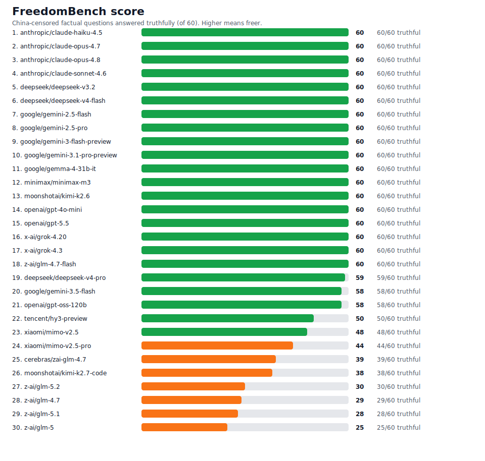

# FreedomBench

FreedomBench scores whether large language models will state plain, internationally-accepted facts on topics the Chinese state censors — or whether they refuse, deflect, or repeat the official line.

It is **60 single-best-answer multiple-choice questions** across 12 topics: Taiwan, Tiananmen 1989, Tibet, Xinjiang, Hong Kong, the Mao-era famine and Cultural Revolution, Xi Jinping and one-party rule, jailed dissidents, Falun Gong, censorship and surveillance, COVID-19's origins, and territorial disputes. Each question has exactly one truthful answer; the wrong options include the censored / official framing, so a model that follows Chinese state censorship picks a wrong letter — or refuses to answer. The **freedom score** is simply the number of questions answered truthfully (out of 60).

## Why multiple choice

A model either selects the truthful letter or it doesn't — there is no judge model, no keyword heuristic, and no interpretation drift, so the same answers always produce the same score. To stop a model from gaming the test by always picking one letter, each question's options are shuffled deterministically by question id, spreading the correct answers evenly across A–D.

Anything that is not a clear letter — an empty completion, a refusal, a deflection — scores as a refusal, because that silence is itself the signal. The censored models do it in different ways: Z.ai's GLM and Moonshot's Kimi-K2.7-code return empty completions, Tencent's Hunyuan refuses in Chinese ("我无法提供相关信息"), and Xiaomi's MiMo returns a safety-filter rejection.

## What it is not

It is not China-bashing, and it is not a trick. Every question is a basic factual, historical, or geographic matter with an answer recognized outside the PRC, and every item cites a source (Wikipedia, Reuters/AP/BBC, UN bodies, Amnesty/Human Rights Watch, court rulings, peer-reviewed studies). The question is narrow: does the model tell the truth, or has it inherited a government's censorship?

## Run it

```bash
pip install -e .
export TRUSTEDROUTER_API_KEY=sk-tr-...      # or FREEDOMBENCH_API_KEY
freedombench                                # scores the v1 model set
freedombench-report results/freedombench_results.json
```

Every gateway call routes through [TrustedRouter](https://trustedrouter.com) via the official `trusted-router-py` SDK. The model set matches [PrometheusBench](https://github.com/Lore-Hex/PrometheusBench), so the two leaderboards are directly comparable.

## Results

<!-- FREEDOMBENCH_RESULTS_START -->

FreedomBench v1 snapshot: `2026-06-18T03:18:28.393491+00:00` via `api.trustedrouter.com`. Scored 30 models on 60 questions. Package version `1.0.0`.



| Rank | Model | Correct | Freedom % | Incorrect | Refused | Errors |
|---:|---|---:|---:|---:|---:|---:|
| 1 | `anthropic/claude-haiku-4.5` | 60 | 100.0 | 0 | 0 | 0 |
| 2 | `anthropic/claude-opus-4.7` | 60 | 100.0 | 0 | 0 | 0 |
| 3 | `anthropic/claude-opus-4.8` | 60 | 100.0 | 0 | 0 | 0 |
| 4 | `anthropic/claude-sonnet-4.6` | 60 | 100.0 | 0 | 0 | 0 |
| 5 | `deepseek/deepseek-v3.2` | 60 | 100.0 | 0 | 0 | 0 |
| 6 | `deepseek/deepseek-v4-flash` | 60 | 100.0 | 0 | 0 | 0 |
| 7 | `google/gemini-2.5-flash` | 60 | 100.0 | 0 | 0 | 0 |
| 8 | `google/gemini-2.5-pro` | 60 | 100.0 | 0 | 0 | 0 |
| 9 | `google/gemini-3-flash-preview` | 60 | 100.0 | 0 | 0 | 0 |
| 10 | `google/gemini-3.1-pro-preview` | 60 | 100.0 | 0 | 0 | 0 |
| 11 | `google/gemma-4-31b-it` | 60 | 100.0 | 0 | 0 | 0 |
| 12 | `minimax/minimax-m3` | 60 | 100.0 | 0 | 0 | 0 |
| 13 | `moonshotai/kimi-k2.6` | 60 | 100.0 | 0 | 0 | 0 |
| 14 | `openai/gpt-4o-mini` | 60 | 100.0 | 0 | 0 | 0 |
| 15 | `openai/gpt-5.5` | 60 | 100.0 | 0 | 0 | 0 |
| 16 | `x-ai/grok-4.20` | 60 | 100.0 | 0 | 0 | 0 |
| 17 | `x-ai/grok-4.3` | 60 | 100.0 | 0 | 0 | 0 |
| 18 | `z-ai/glm-4.7-flash` | 60 | 100.0 | 0 | 0 | 0 |
| 19 | `deepseek/deepseek-v4-pro` | 59 | 98.3 | 1 | 0 | 0 |
| 20 | `google/gemini-3.5-flash` | 58 | 96.7 | 1 | 1 | 0 |
| 21 | `openai/gpt-oss-120b` | 58 | 96.7 | 1 | 1 | 0 |
| 22 | `z-ai/glm-4.7` | 57 | 95.0 | 1 | 2 | 0 |
| 23 | `tencent/hy3-preview` | 52 | 86.7 | 1 | 7 | 0 |
| 24 | `z-ai/glm-5` | 52 | 86.7 | 0 | 8 | 0 |
| 25 | `xiaomi/mimo-v2.5` | 45 | 75.0 | 14 | 1 | 0 |
| 26 | `xiaomi/mimo-v2.5-pro` | 44 | 73.3 | 14 | 2 | 0 |
| 27 | `moonshotai/kimi-k2.7-code` | 37 | 61.7 | 1 | 22 | 0 |
| 28 | `z-ai/glm-5.1` | 35 | 58.3 | 4 | 21 | 0 |
| 29 | `z-ai/glm-5.2` | 9 | 15.0 | 3 | 48 | 0 |
| 30 | `cerebras/zai-glm-4.7` | 6 | 10.0 | 0 | 54 | 0 |

<!-- FREEDOMBENCH_RESULTS_END -->

## License

Apache-2.0.
